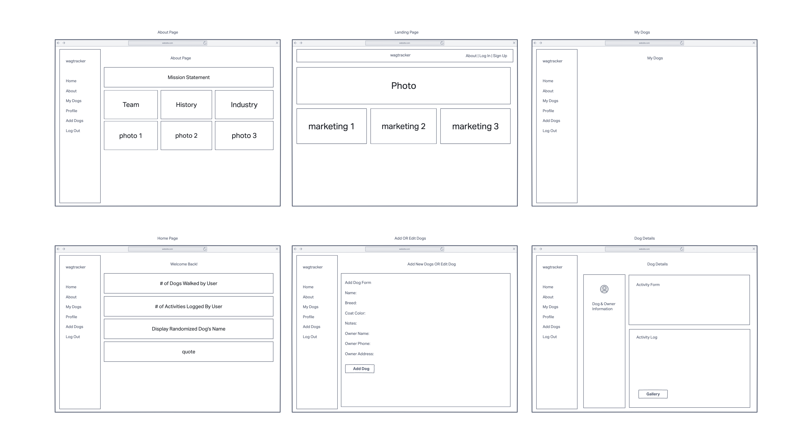

## Wagtracker

This app allows companies to streamline their processes to improve customer relationship management. 

## User Stories 

- As a user, I want to view all the dogs I am assigned to.

- As a user, I want to view information about the dogs I am assigned to.

- As a user, I want to track my activities with the dog. 

- As a user, I want to add new dogs and edit information about these dogs.

## Technologies Used

- Django 
- Python
- HTML5
- CSS3
- Materialize
- AWS
- Docker
- Postgres
- Geocoder
- Folium

## Screenshots

## Getting Started

[Click Here](https://wagtracker.herokuapp.com/)

## Trello

[Trello](https://trello.com/b/tUW99s8N/wagtracker)

## Pitch Deck

[Pitch-Deck](https://docs.google.com/presentation/d/15bK9PHujylshrNctUZRR9L4fhBNe_1IYaZlNfjWn2nU/edit#slide=id.p)

## Future Enhancements 

- As a user, I want to see the direction from the walker to the dog on a map. 

- As a user, I want to see dogs who are avaliable for walking who are not assigned to a walker. 

- As a user, I want to see a dashboard of all my activities.

- As a user, I want to clock in and out for my working hours.

- As a user/admin, I want to be reset my password. 

- As a user, I want to chat with other walkers.
